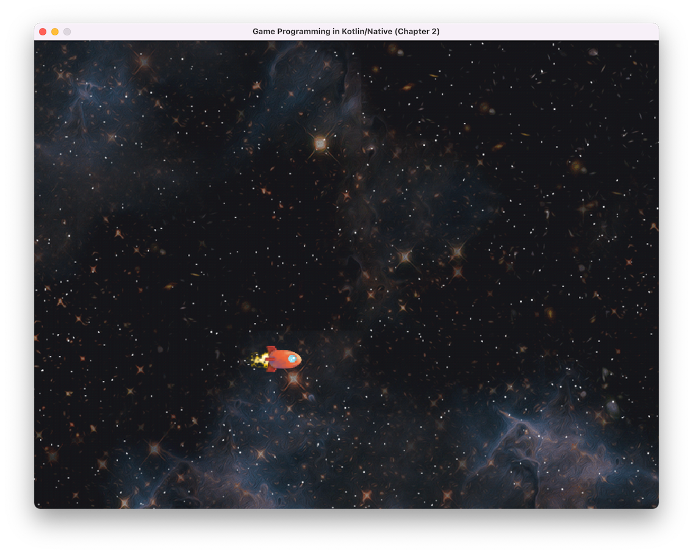

# Chapter2

## 前提条件

`Homebrew` などで SDL2 をインストール

```
brew install sdl2 sdl2_image
```

## ビルド・実行

Assets ディレクトリに [画像ファイル](https://github.com/gameprogcpp/code/tree/master/Chapter02/Assets)を用意

```
./gradlew assemble
./gradlew runDebugExecutableChapter2
```

と gradle を実行

## 実行結果
